# ECC Cinema (HNC Project)

A PHP/MySQL cinema web application with user accounts, movie listings, bookings, reviews, admin pages, and Stripe test checkout support.

## Tech Stack

- PHP (WAMP/local Apache)
- MySQL / MariaDB
- Composer packages:
  - `stripe/stripe-php`
  - `endroid/qr-code`
  - `chillerlan/php-qrcode`
- Bootstrap 5

## Features

- User registration/login/logout
- Movie listing + movie detail pages
- Booking flow + user bookings
- Account management
- Reviews (create/edit/delete + like/dislike)
- Admin pages for movies/users/bookings
- Stripe test-mode checkout integration

## Project Structure

```text
.
cinema
    ├───img
    ├───includes
    ├───logs
    ├───phpqrcode
    │   ├───bindings
    │   │   └───tcpdf
    │   ├───cache
    │   │   ├───mask_0
    │   │   ├───mask_1
    │   │   ├───mask_2
    │   │   ├───mask_3
    │   │   ├───mask_4
    │   │   ├───mask_5
    │   │   ├───mask_6
    │   │   └───mask_7
    │   └───tools
    ├───scss
    ├───sql
    └───uploads
```

## Local Setup (Windows/WAMP)

1. Start WAMP and ensure services are green.
2. Create database `cinema_db` in phpMyAdmin.
3. Import `setup_database.sql`.
4. Copy `.env.example` to `.env` and update values:

```env
DB_HOST=localhost
DB_USER=root
DB_PASS=
DB_NAME=cinema_db
STRIPE_PUBLISHABLE_KEY=pk_test_your_key
STRIPE_SECRET_KEY=sk_test_your_key
OMDB_API_KEY=your_omdb_api_key_here
TMDB_API_KEY=your_tmdb_key_here
```

5. Install dependencies:

```bash
composer install
npm install
```

6. Open in browser:

- `http://localhost/cinema/home.php`

## Test Admin Account

- Email: `admin@eccinema.com`
- Password: `admin123`

> Change this in production/public deployment.

## Security Notes (before public repo)

- Never commit `.env` (only keep `.env.example` in git)
- Use Stripe **test** keys only in development
- Remove/rotate any credentials if they were ever committed

<<<<<<< HEAD
=======
## Screenshots

### Home Page
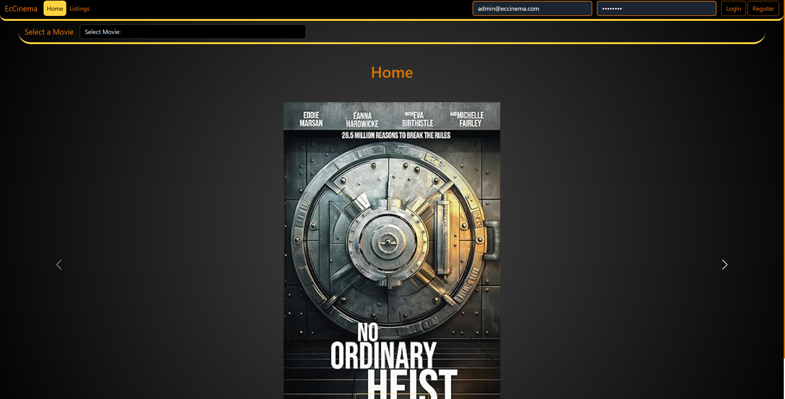

### Movie Listing
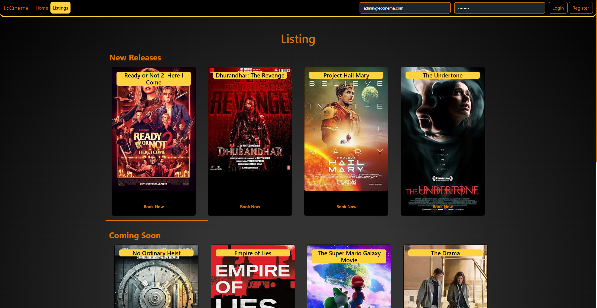

### Movie Description
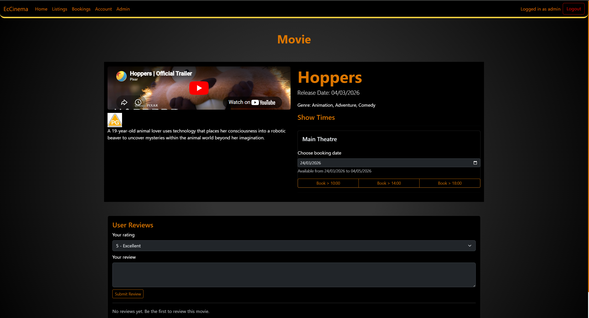

### Checkout
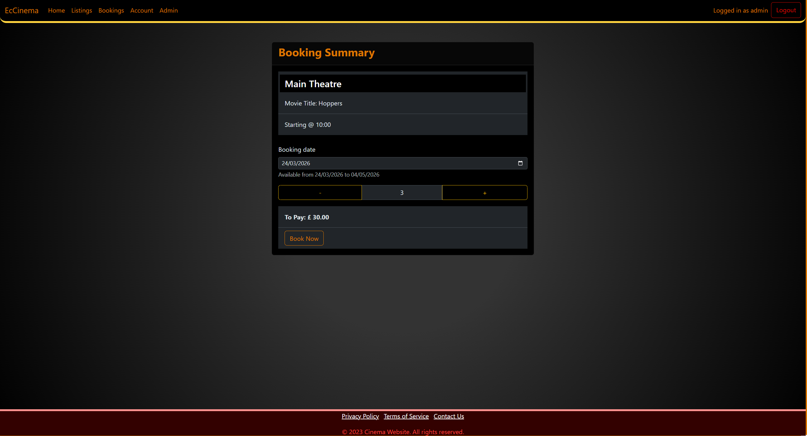

### Stripe Payment
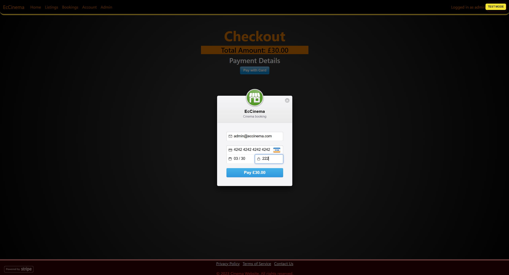

### QR Code Generation
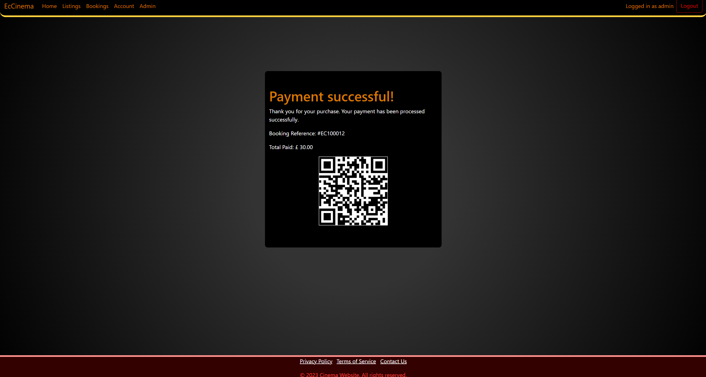

### Bookings History
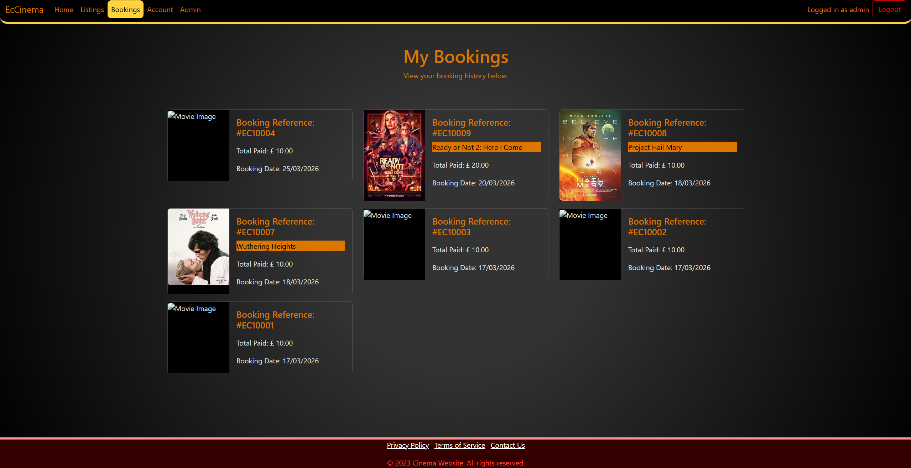

### User Account
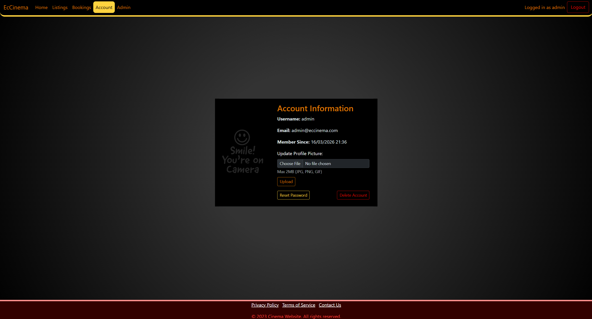

### Admin Dashboard
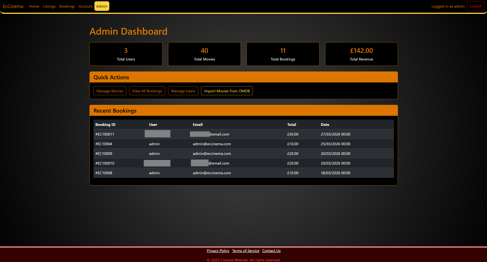

### Admin All Bookings
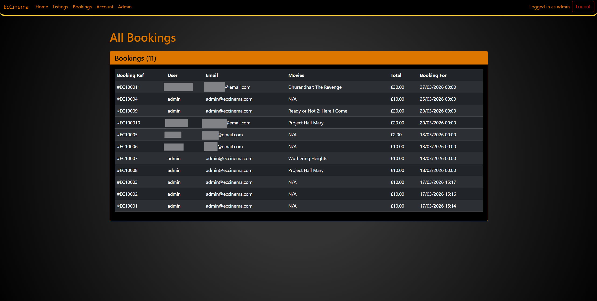

### Movies Management
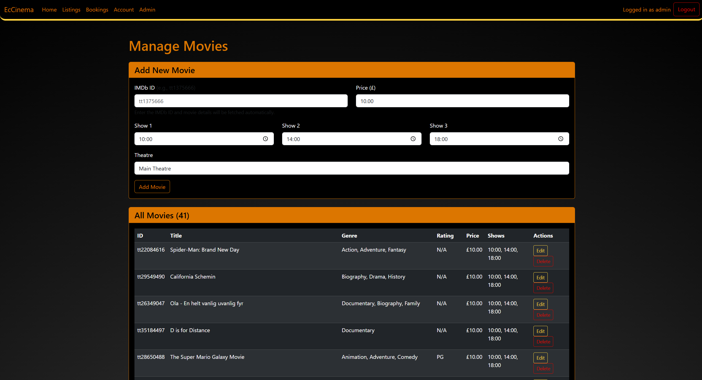

### User Management
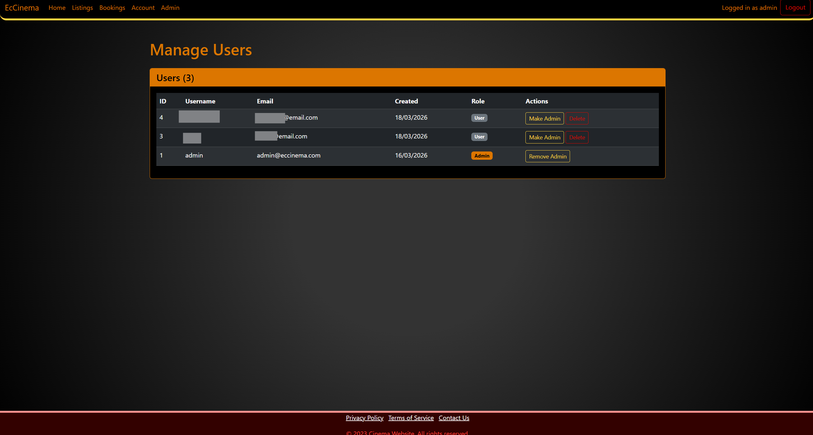

## License

Educational project (HNC coursework).